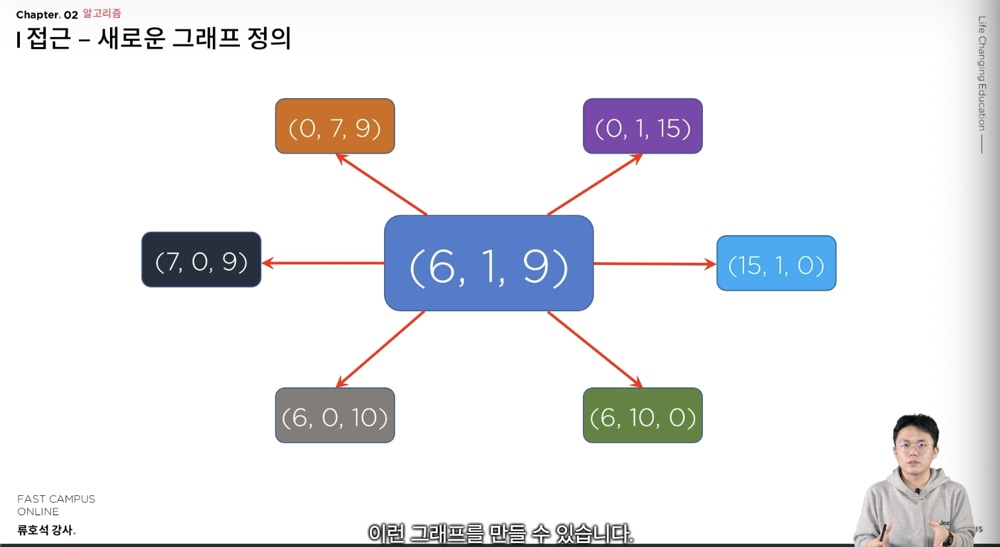

## BOJ1260 DFS와 BFS

### 문제풀이시 막혔던 사항
1. Map 자료구조를 사용하여 그래프의 인접리스트를 구현하는 경우, 빈 Key에 대해 리스트 초기화해주는 것에서 오류 발생
   - 웬만하면 computeIfAbsent를 숙지하고, 기억이 나지 않는 경우 조건문으로 작성하자.
2. BufferedWriter에 대한 flush 사용 시점. 이 부분에 대한 정확한 공부가 필요할듯 하다. 
   - 해당 부분은 study/io 파트에 정리
3. Collections.sort()의 시간복잡도 정확히 암기하기.

## BOJ2667 단지번호 붙이기
- 빈출 유형. 그래프로 해석하여 푸는 문제 유형.
- 정답의 최대치는 N이 최대 25이기 때문에, 대략 625개의 집이 생성될 수 있다. 또한 최대 단지의 수는 0,1이 반복되는 구조이기에 최대 약 300개의 단지(N^2/2)가 형성될 수 있다.
   - 따라서 저장하는 공간은 Integer 범위에 포함된다. (항상, 저장하는 자료형의 범위를 고려하자.)
- 이 문제처럼 2차원 배열에 표현된 그래프를 **격자형 그래프**라고 한다. 격자형 그래프를 코드로 표현하는 방법을 익히자. 정점과 간선을 어떻게 표현할지 고민하면 된다.
  - 이 문제에서는 각 격자 한칸이 정점. 인접하는 격자가 같은 값(1)인 경우, 간선으로 해석하면 된다. 
- 처음에 내가 푼 방법은 인접하는 점(동 서 남 북)에 대해, 조건문 if로 계산하였다. 이렇게 수작업으로 작성해주게 되면, 이번 문제는 조건이 4개이기에 괜찮지만 많아지는 경우 코드를 작성하기에 어려워진다.
  - **따라서 간선의 관계를 표현하는 배열을 만들면 이를 해결할 수 있다.**
  - 이 문제에서는 dir[4][2] = { (-1,0), (0,1) , (1,0) ,(0,-1) } 을 미리 저장하고, 모든 정점에 대해 해당 배열의 원소를 더해 인접한 정점을 구하면 된다.
- 시간 복잡도는 정점의 개수가 N^2개 간선의 개수는 N^2 * 4이므로 인접리스트로 구현한다면, 시간복잡도는 O(2E)이므로 O(N^2)이 된다.
- 우선 핵심은  **[따라서 간선의 관계를 표현하는 배열을 만들면 이를 해결할 수 있다.](../../../../../../../study/graph/README1.md)** 이 부분임을 잊지 말자.

## BOJ2251 물통
- 해당 문제가 어려운 이유는 그래프 유형으로 파악하기 어렵기 때문이다.
- 그래프와 전혀 연관이 없어보이는 문제에서도, 정점과 간선을 잘 정의해서 그래프 관점에서 풀어야 하는 문제.
- 각 물통의 최대 용량을 대문자 A,B,C로 정의하고 현재 물의 상태를 a,b,c로 표현하자. 이때 초기 상태는 (0,0,C)가 될 것이다.
- 이때, a,b,c가 가지는 범위는 최대 0 < a,b,c < 200 이므로, 200 * 200 * 200으로 800만 경우가 된다. 모든 상태 경우를 다 탐색한다고 하더라도 1억개가 되지 않으므로 완전탐색으로도 접근 가능함을 알 수 있다.
- 현재 물의 상태를 정점, 물을 붓는 행위를 간선으로 정의하면 아래 그림과 같이 표현할 수 있다. 

- 주의할 점은 단방향 그래프이다. 각 물통당 다른 물통 2개에 물을 부울 수 있기 때문에 총 6개의 간선이 만들어진다.(이때는, 아직 각 물통의 수용 용량을 고려하지 않은 상태이다.)
- 가능한 모든 상태를 그래프로 연결하고, 탐색을 통해 원하는 조건을 찾아내는 방식으로 문제를 해결 할 수 있다.
- 따라서 정점은 O(8 * 1000000)개이고, 간선은 O(8 * 1000000 * 최대6)개이므로 BFS이든 DFS이든 인접리스트를 사용한다면, 시간 복잡도는 대략 O(8 * 1000000)가 될 것이다.

## BOJ14502 연구소
- 정답의 최대치를 먼저 파악하자. 안전영역의 개수는 최대 O(N*M)개 가능하다.
- 해당 문제도 격자형 그래프 문제이다. **[따라서 간선의 관계를 표현하는 배열을 만들면 이를 해결할 수 있다.](../../../../../../../study/graph/README1.md)** 
- 3개의 벽을 세울 수 있는 최대 경우의 수는 몇개 일까? 빈공간을 b로 둔다면 bC3(조합)이 될 것이다. 빈 공간은 최대 64개까지 가능하므로, 막을 수 있는 방법의 수는 약 41000개 가능하다. 모든 벽을 세우는 경우를 완전탐색으로 수행 가능하다.
- 그리고, 매번 직접 탐색을 통해서 바이러스로 부터 안전한 구역을 확인한다. 이는 O(T)만큼의 시간이 소요된다. 따라서 총 시간 복잡도는 O(41000 * T)이다.
- 탐색에 해당하는 시간 T를 구해보자. 해당 칸이 2인 경우 모두 그래프 탐색의 시작점이 되야 하기 때문에 **멀티 소스 BFS**를 고려할 수 있다.
- **[멀티 소스 BFS](../../../../../../../study/graph/README1.md)란 시작점이 여러개인 탐색에서 사용할 수 있는 기법을 의미한다.**
- 따라서 멀티소스 BFS를 사용하면 O(V+E)만큼의 시간내에서 해결가능하다. 정점의 개수는 N * M이므로 T = M * N이 된다. 따라서 최종 시간복잡도는 260만이 된다.

## BOJ2178 미로 탐색
- BFS의 성질을 활용하여, [최소 이동 횟수를 구하는 문제](../../../../../../../study/graph/README1.md)
