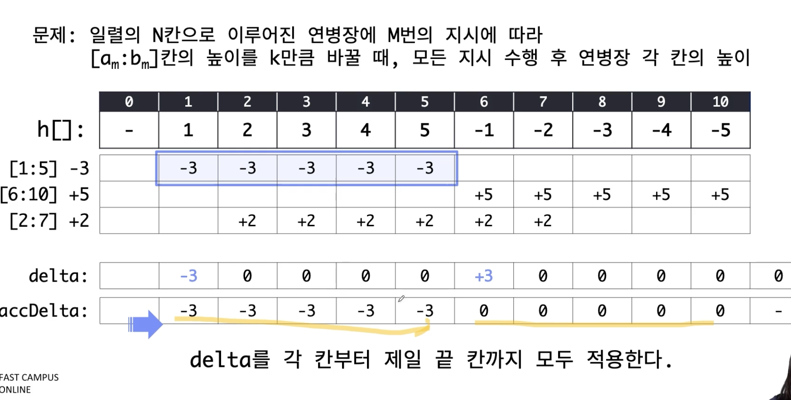

# Prefix Sum (구간합 알고리즘)

## 문제집
### 1. BOJ19951번 태상이의 훈련소 생활
- 완전탐색으로 구현시, O(M*N)으로 10,000,000,000 시간초과
- [차분 배열 기법](../../../../../../../study/prefixSum/README1.md)을 이용하여 O(M+N) 시간 내에 해결 가능
- 결국 아이디어는, 구간에 대해 업데이트를 해줘야 할때(범위 연산), O(1)시간안에 해결하기 위한 경우, 차분 배열을 고려할 수 있다.

- 

