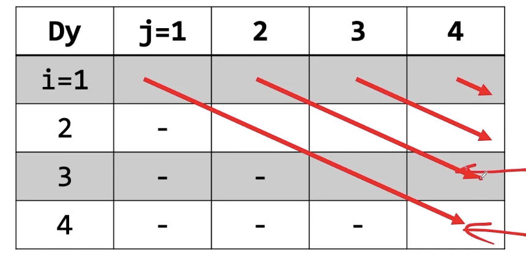

# 배열 (Array)

## 1. 기본 문법

### 1. 이차원 배열에서 한 행 분리하기

- 주의. 한 열(세로)를 분리하는 것은 수동으로 해주어야 함. (for문 사용)

```java
int[][] arr; //일때,
int[] firstRowOfArr = arr[0]; // 첫번째 행 분리
```

### 2. 배열 생성과 동시에 초기화

- 1차원 배열

```java
int[] arr = new int[] {1, 2, 3};
//혹은
int[] arr = {1, 2, 3, 4, 5};
```

- 2차원 배열

```java
int[][] arr = new int[][] {
        {1, 2},
        {3, 4}
};
//혹은
int[][] arr = {
        {1, 2, 3},
        {4, 5, 6},
        {7, 8, 9}
};
```

### 3. 배열 크기만 지정

- **자동으로 0으로 초기화 된다.**

```java
int[][] arr = new int[3][4];
```

## 빈출 유형

### 1. 2차원 배열 대각선 순회하기



- 원리: 2중 포문을 각 배열의 행(i)과 열(j)가 아닌, 행(i)와 len(j-i)을 기점으로 for문 돌리기

```java

/**
 * @Deprecated 대각선 순서(왼쪽 위에서 아래)로 탐색 2중 for문 접근법 - 각 행과 열의 i와 j를 2중 for문으로 사용하지 않고, i와 len를 기반으로 2중 for문을 구성하는 방식.
 * 구간의 길이 len은 j-i로 구성된다.
 *
 * <br>
 * 정석 코드는 위의 Readme에서 확인.
 * @see <a href="https://github.com/sangjun121/algorithm-self-study-java/tree/main/study/array">Readme</a>
 * 에서 확인
 */
private static void findByDiagonalSeq() {
    int[][] arr = new int[4][4];
    int k = 4 - 1; //길이의 최대는 4

    for (int len = 0; len <= k; len++) {
        for (int i = 1; i <= k + 1 - len; i++) {
            int j = i + len;
            // arr[i][j] 처리
        }
    }
}
```
