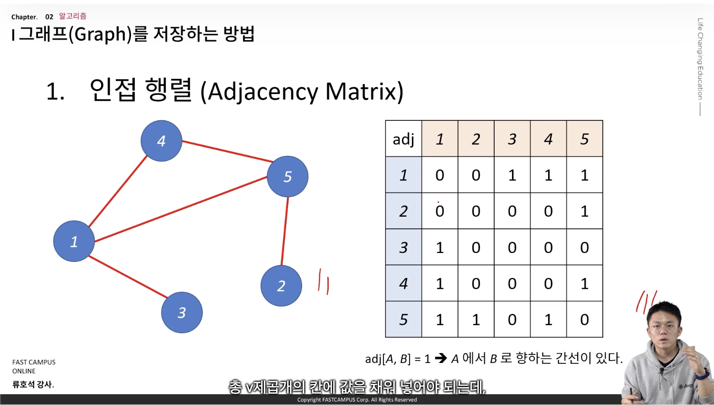
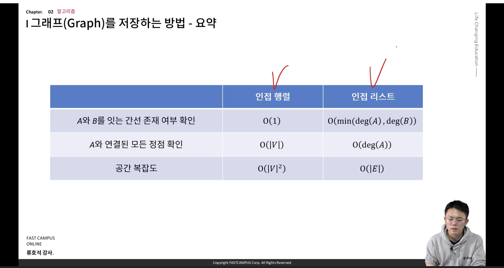
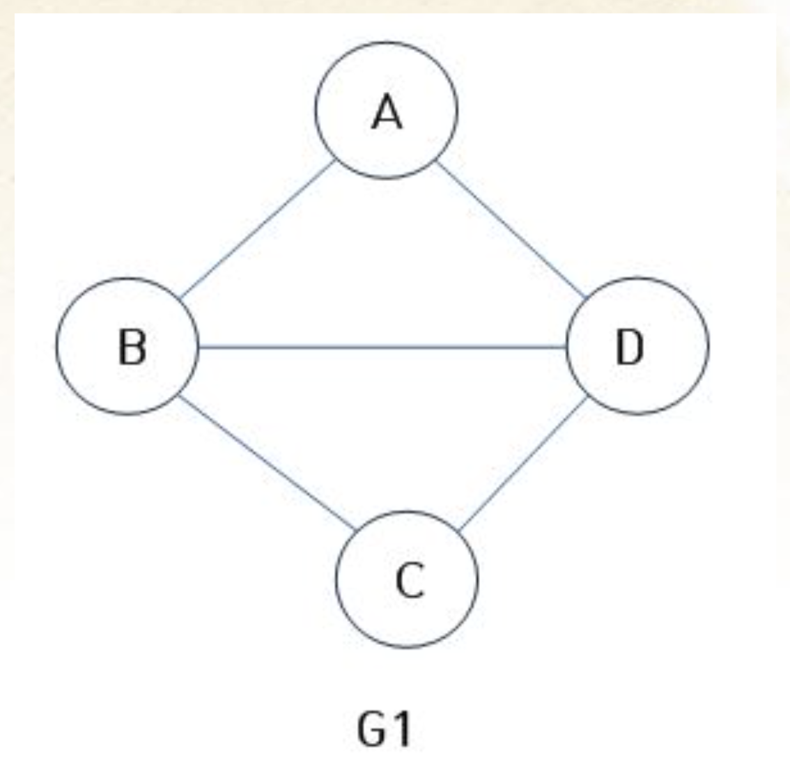

# 그래프 개요 - 주요 개념

- 첨언. 아래 설명은 BOJ15681의 그래프 힌트를 그대로 작성한 것이다.

## 설명


그래프란, 정점(V)들과 정점 둘을 잇는 간선(E)들로 이루어진 집합을 의미한다.

위는 9개의 정점(원 모양)과, 10개의 간선(실선) 들로 이루어진 그래프이다. 각 원의 내부에 쓰여 있는 숫자는 편의상 정점에 매긴 번호를 의미한다.

붉은 간선은 차후 설명의 편의상 색칠해 둔 것으로, 우선은 다른 검은 간선과 동일한 것으로 간주하도록 하자.

간선은 항상 두 정점을 잇게 된다. 이제부터의 설명에서는, 각 정점을 번호로(1번 정점, 2번 정점.. ), 간선을 양 끝점의 정점의 번호로(1-3, 3-2… ) 표기하도록 하자.

그래프의 간선에는 가중치가 있을 수도 있다. 만일 특별한 언급이 없다면 모든 간선의 가중치가 1인 그래프로 간주할 수 있으며, 가중치가 존재한다면, 예를 들어 1-3 간선의 가중치가 3이라면, 1번 정점에서 3번
정점으로 가기 위해선 길이 3인 간선을 지나야 한다고 표현한다. 위의 그래프는 모든 간선의 길이가 1인 예시라고 보면 된다.

그래프의 간선에는 방향성이 있을 수도 있다. 예를 들어, 1번과 3번 정점 사이에 놓인 1-3 간선의 경우, 1->3 또는 3->1의 방향성을 가지는 것이 가능하다. 방향성 간선을 갖고 있는 그래프를 ‘유향
그래프’, 위의 그림처럼 방향성이 없는 간선만으로 이루어진 그래프를 ‘무향 그래프’ 라 한다. 간선의 방향성은 그래프에서 탐색을 진행할 때 결과를 달리할 수 있다. 예를 들어, 현재 위의 그래프에서 1번 정점에서
4번 정점까지 가면서, 간선을 최소한 거치는 경로는 1->3->4로, 총 2개의 간선을 거친다. 우리는 이것을 ‘1번 정점과 4번 정점의 최단 경로는 2다’ 라고 표현한다. 하지만 만약 3번 정점과 4번 정점 사이의
간선이 4->3의 방향성을 가진다면, 1번 정점에서 4번 정점으로 가는 최단 경로는 1->3->6->5->4 로, 총 4개의 간선을 지나야 한다. 즉, 최단 경로가 4가 된다.

그래프에서는 ‘사이클’ 을 정의할 수 있다. **무향 그래프에서의 사이클이란, 어떤 정점에서 출발해 시작점을 제외한 어떤 정점도, 어떤 간선도 두 번 이상 방문하지 않고 시작점으로 돌아올 수 있는 경로를 의미한다.
** 예를 들어, 위의 그림에서는 3-6-5-4-3 사이클과, 6-7-9 사이클이 존재한다. 1-3-1은 1-3 간선을 두 번 지났으므로 사이클이 될 수 없으며, 1-3-6-5-4-3은 시작점으로 돌아오지 않는
경로이므로 사이클이 아니다.

그래프에서 정점은 차수(Degree)를 가진다. **정점 x에 연결된 간선의 수를 차수라고 부르며 이를 deg(x)라고 표현한다.** 각 정점의 차수는 서로 다를지언정, **모든 정점의 차수를 다 더하면, 간선의
개수(eCount)의 2배가 된다.** 해당 수식은 그래프와 관련된 알고리즘에서 시간복잡도를 구할 때 활용된다.

**만일 그래프에 단 하나의 사이클도 없다면, 해당 그래프는 ‘트리’ 라고 부른다.** 이는 그래프가 마치 하나의 정점에서 출발해 피어난 나무 모양과도 같음에 붙여진 이름으로, 예를 들어 **위의 그림에서 빨간 간선
두 개를 제거한다면 위의 그래프는 트리가 된다.** 예를 들어, 상단에 주어진 그래프에서 빨간 간선 두 개를 제거한 뒤 만들어진 트리의 모습은 아래와 같다.


일반적으로 그래프에서는 정점의 위치나 간선의 모양 등에 대한 조건은 전혀 고려하지 않으며, 오직 연결성만을 고려하므로, 간선의 집합이 변하지 않는다는 가정 하에 그래프를 얼마든지 다시 그릴 수가 있다. 위의 트리에서
5번 정점을 잡고 위로 들어올리는 예시를 생각해 보자. 아래쪽에 중력이 작용한다고 생각하고 5번 정점을 위쪽으로 들어올리게 되면 트리의 모양은 아래와 같이 변할 것이다.


간선의 집합에 변함이 없는 한, 그래프는 얼마든지 원하는 대로 다시 그릴 수가 있다. 예를 들어, 위의 트리를 거울에 비추어 좌우를 바꿀 경우에도 동일한 트리가 된다.

**트리에는 루트(root)가 있을 수도 없을 수도 있지만, 편의를 위해서라면 아무 정점이나 루트로 선택할 수 있다.** 5번 정점을 루트로 하였다고 생각한 뒤 위의 트리를 다시 보도록 하자.

트리는 항상 루트를 기준으로 다시 그릴 수 있기 때문에, 루트가 고정되지 않는 한 어떤 정점이 ‘위에’ 있는지 판정할 수는 없다. 하지만 **루트가 고정된다면, 우리는 정점 간에 ‘부모’ 와 ‘자식’ 의 관계를
정의할 수가 있다.** 예를 들어, 위의 트리에서는 4번 정점의 부모는 5번 정점이며, 3번 정점은 4번 정점의 자식이 된다. 5번 정점의 부모는 없으며, 4, 6번 정점을 두 자식으로 갖게 될 것이다.

트리에는 몇 가지 중요한 성질이 있는데, 그 중 두 가지만 추려보자면 아래와 같다.

- 임의의 두 정점 U와 V에 대해, U에서 V로 가는 최단경로는 유일하다.
- 아무 정점이나 잡고 부모와의 연결을 끊었을 때, 해당 정점과 그 자식들, 그 자식들의 자식들… 로 이루어진 부분그래프는 트리가 된다.

둘 모두 직관적이며 자명한 사실이므로 증명은 생략한다. 두 번째 성질에서, 끊어진 부분그래프로 만들어진 트리를 ‘서브트리’ 라고 부른다.

만약 트리에 대한 문제 하나가 출제되었다고 가정해보자. 입력이 위처럼 루트와 그 자식들로 이루어진다면 좋지만, 루트가 없는 일반 트리의 형태(두 번째 그림)의 형태로 입력이 주어질 수도 있다. 예를 들어, 정점의
개수와 간선의 목록만이 주어진다면, 어떻게 트리를 구성할 수 있을까?

예를 들어, 위의 트리에 대해 정점의 개수와 간선의 목록이 아래와 같이 입력된다고 하자.

```java
9
        1 3
        4 3
        5 4
        5 6
        6 7
        2 3
        9 6
        6 8
```

첫 줄의 9는 정점의 개수이며, 나머지 8쌍의 두 정수는 간선의 양 끝점 번호를 의미한다. **트리에서의 간선의 개수는 항상 정점의 수 - 1이라는 것은 익히 알려진 사실이며, 증명 또한 어렵지 않으므로 설명을
생략한다.**

위와 같은 데이터를 트리로 구성하기 위해서는, **우선 루트 하나를 임의로 정의하는 것이 편하다. 5번 정점을 루트로 정해보도록 하자.**

트리에는 부모와 자식 관계가 있으므로, 각 정점별로 부모가 누구인지, 자식들의 목록은 어떻게 되는지를 저장해 두면 요긴하게 쓰일 것이다. 이를 아래와 같이 구현할 수 있다.

```java
def makeTree(currentNode, parent) :
        for(
Node in
connect[currentNode]):
        if Node !=parent:
add Node
to currentNode’
s child
set Node’
s parent
to currentNode

makeTree(Node, currentNode)
```

currentNode는 현재 탐색 중인 정점이며, parent는 해당 정점의 부모 정점이다.

트리에서는 (눈치챘을 수도 있지만) 어떤 정점의 부모는 하나이거나 없다. 따라서, **어떤 정점에 대해 연결된 모든 정점은 최대 한 개의 정점을 제외하면 모두 해당 정점의 자식들이 될 것이다.** 이에 따라, 부모
정점의 정보를 가져가면서, 부모 정점이 아니면서 자신과 연결되어 있는 모든 정점을 자신의 자식으로, 자신의 자식이 될 정점들의 부모 정점을 자신으로 연결한 뒤 재귀적으로 자식 정점들에게 트리 구성을 요청하는 형태의
함수이다.

위와 같이 정의한 뒤엔, 메인 함수에서 한 차례 makeTree(5, -1) 을 호출할 경우 5번 정점을 루트로 하는 트리를 구성할 수 있다. -1은 부모가 없음을 의미한다.

그렇다면, 일반적인 형태의 트리에서 루트가 주어진 뒤 여러 질의가 주어지는 상황을 생각해 보자. 예를 들어, 5번 정점을 루트로 하는 트리에 대해, ‘정점 U를 루트로 하는 서브트리의 정점의 수는 얼마인가?’ 라는
질의가 다수 주어진다고 해 보자. U를 루트로 하는 서브트리란, 위에도 언급하였지만 정점 U와 그 부모의 연결을 끊고 정점 U를 기준으로 그 자식들, 자식들의 자식들… 로 만든 트리를 말한다. 예를 들어, 5번
정점이 루트일 때 4번 정점을 루트로 하는 서브트리에서의 정점의 수는 4개이며, 8번 정점을 루트로 하는 서브트리에서의 정점의 수는 1개가 된다.

물론 직접 연결을 끊은 뒤 다시 정점의 수를 세는 방법도 가능하겠지만, 트리의 정점 수가 많고, 질의 또한 많다면 프로그램이 제한시간 내에 수행될 수 없을 확률이 높다. 아마 미리 모든 정점을 각각 루트로 하는
서브트리에서의 정점의 수를 빠르게 구해 둘 방법이 있다면 좋을 것이다.

이를 구현하기 위해, 트리를 구성하던 코드의 동작 과정을 살펴보도록 하자. 루트에서 출발하여, 자식 정점들에 대해 한 번씩 트리 구성을 요청하게 된다. 여기에서 알 수 있는 사실은, **자식 정점들에 대한
makeTree가 호출된 뒤엔, 해당 자식 정점을 서브트리로 하는 트리가 구성이 완료된다는 것이다.** 이와 같은 원리로 모든 정점에 대해 해당 정점을 루트로 하는 서브트리에 속한 정점의 수를 계산하는 함수를
만들어보도록 하자

```java
def countSubtreeNodes(currentNode) :
size[currentNode]=1 // 자신도 자신을 루트로 하는 서브트리에 포함되므로 0이 아닌 1에서 시작한다.
        for
Node in
currentNode’
s child:

countSubtreeNode(Node)

size[currentNode]+=size[Node]
```

자식 정점들에 대해 모두 서브트리에 속한 정점의 수를 계산하게 만든 뒤 각각의 정점 수를 더해 자신을 루트로 하는 서브트리에 속한 정점의 수를 만들게 된다. 이제 메인 함수 내에서 makeTree(5, -1)과
countSubtreeNodes(5) 를 차례대로 한 번씩 호출할 경우, 5번을 루트로 하는 트리에서 모든 정점에 대해 각 정점을 루트로 하는 서브트리에 속한 정점의 수를 계산해둘 수가 있다. 이를 이용하면, 모든
질의 U에 대해 size[U] 를 출력하기만 하면 되므로, 정점이 10만 개, 질의가 10만 개인 데이터에서도 충분히 빠른 시간 내에 모든 질의를 처리할 수가 있게 될 것이다.

## 그래프를 코드로 구현하는 방법

그래프를 저장하는 대표적인 방법은 2가지가 있다. 인접행렬과 인접리스트이다. 어떤 문제에서는 둘중 하나만 사용가능할 수도 있기 때문에, 두가지 모두 잘 알아두자.

### 1. 인접행렬로 그래프 표현하기


행렬이 의미하는 바는, adj[A,B] = 1 이라면 A -> B로 가는 간선이 있다는 의미이다. 따라서 무방향인 경우 adj[B,A]도 1이 된다.

- 만약에 가중치가 있는 간선이라면 1 대신 가중치 값을 표현하면 될 것이다.

```java
int[][] adj = new int[V][V];
```

- 공간복잡도: V^2만큼의 공간복잡도가 필요
- 시간복잡도:
    - A -> B로 이동하는 간선이 존재하냐? 라는 쿼리에 대한 시간복잡도는 O(1)
    - 정점 A에서 갈수 있는 정점들은? 라는 쿼리에 대한 시간복잡도는 O(V)
- **인접 행렬의 문제점**
    - V^2만큼의 공간복잡도가 필요하다. 따라서 정점의 개수가 V = 10만이라면 V^2은 100억이며 총 10G의 공간이 필요. int타입인 경우 40G 소모.
    - 간선의 실제 개수에 비해 이차원 배열이 0인 공간이 너무 많기 때문에, 공간의 활용도가 떨어진다. 구현하기는 쉽지만 메모리 이슈가 있다. 이 문제를 해결하기 위해 인접리스트를 사용할 수 있다.

### 2. 인접리스트로 그래프 표현하기


- 인접행렬의 불필요한 공간을 없애고, 연결된 것만 리스트로 표현할 수 있는 구현 방식이다.
- 동적 배열로써, 해당 배열 원소는 정점v가 갈수 있는 정점번호를 담고 있다.

```java
import java.util.ArrayList;

ArrayList<ArrayList<Integer>> adj;

// 실제 코드
int N = 10;

ArrayList<Integer>[] adj; // ArrayList의 배열을 의미한다.
adj = new ArrayList[N+1];
```

- 공간복잡도: 모든 간선의 차수의 합만큼의 공간이 필요하기 때문에, 2E만큼의 공간복잡도가 필요 따라서 O(E) 공간 소모.
- 시간복잡도:
    - A -> B로 이동하는 간선이 존재하냐? 가중치는 얼마냐? 라는 쿼리에 대한 시간복잡도는 양향병성이라면, O(min(deg(A),deg(B))) 소모되고, 방향성 그래프라면, O(deg(A))
    - 정점 A에서 갈수 있는 정점들은? 라는 쿼리에 대한 시간복잡도는 O(deg(A))

### 결론. 위 두가지 방법의 공간,시간복잡도 비교 정리



- 결국, 쿼리의 종류와 공간복잡도의 기준을 먼저 살피고, 두가지 방법중 하나를 적재적소에 사용하면 된다.

## 그래프 문제의 핵심!

- 문제에서 정점과 간선을 명확하기 숫자로 제공하지 않을 수 있다. 예를 들어 마을과 다리. 따라서 **정점과 간선에 대한 정확한 대응**를 우선 정의한다.
- 그리고, 어떤 방식을 사용하여 간선을 저장할지 결정하다. (팁, 대부분의 경우 인접리스트를 사용하기에 이를 숙달하자.)

# 그래프에서의 탐색(search)이란?

- 탐색: **시작점에서 간선을 0개 이상 사용해서 갈 수 있는 정점들은 무엇인가?**
- 인접행렬이나 리스트를 보고 컴퓨터가 어떻게 간선을 탐색할 수 있는지 알아보자.
- 탐색의 알고리즘은 크게 2가지가 있다. 깊이 우선 탐색(DFS)과 너비 우선 탐색(BFS)

## 1. 깊이 우선 탐색(DFS)

- dfs(v)라는 함수로 구현가능하다. 이때 이 함수의 의미는 v라는 정점을 갈 수 있다는 것을 알고, 방문한 상태를 의미하며, 재귀로 탐색을 진행한다. 정확한 코드는 다음과 같다.
- 가장 깊은 곳부터 찾아서 올라오는 방식이다.

```java
static void dfs(int v) {
    visit[v] = true; // 해당 정점 v를 방문 표시.

    //v에서 갈 수 있는 모든 정점을 방문한다.
    for (int w : v에서 갈수 있는 점들의 집합){
        if (visit[w]) // 이미 w를 방문했다면, 다시 갈 필요 없다.
            continue;
        dfs(w); // 재귀 탐색
    }
}
```

위의 코드로부터 도출되는 중요한 사실(key point)은 다음과 같다.

1. 모든 정점 v대해서 dfs(v)는 한번씩만 호출된다. 이미, visit[v]로 방문한 경우에만 dfs()를 재귀호출하기에 딱 1번만 호출된다.
2. 아래코드에서 **_v에서 갈수 있는 점들의 집합_** 은 인접행렬, 인접리스트로 표현될 것이다. 따라서 이 for문의 시간복잡도는 인접행렬인 경우 O(v), 인접리스트인 경우 O(deg(v))가 될 것이다.

    ```java
   //v에서 갈 수 있는 모든 정점을 방문한다. 
   for (int w : v에서 갈수 있는 점들의 집합){
   }
    ```
3. **중요** 1,2번의 재귀호출과 for문을 고려하면 최종적인 시간복잡도는 
   - 인접 행렬인 경우: O(V) * O(V) = O(V^2)
   - 인접 리스트인 경우: O(deg(1) + deg(2) + deg(3) + ... + deg(v)) = O(2E) = O(E)만큼의 시간이 걸린다.   
   
    **따라서 인접리스트로 구현한다면, DFS의 최종시간 복잡도는 O(E)이다.**
4. 결론, V^2이 E보다 월등이 큰 그래프라면, 인접리스트를 사용하자.

## 2. 너비 우선 탐색(BFS)
- 큐를 사용하며, 다음에 탐색할 노드를 보관한다. DFS와 다르게 재귀가 아닌, Queue가 빌때까지 반복하는 방식으로 구현 가능. (2-2. 구현 코드 살펴보기 확인)

### 2-1. Queue가 들고있는 자료의 의미
- 방문이 가능한 정점들을 찾을때, Queue에 해당 정점을 넣는다. **따라서 Queue에 정점이 남았다는 것은 아직 방문 가능한 점이 남아있다는 의미 혹은 탐색중임을 나타낸다**
- 반대로 Queue가 비었다는 의미는 시작점에서 갈 수 있는 모든 점을 찾아냈거나, 탐색이 끝났음을 의미한다.
- Queue의 처음 초기값은 시작노드(start)에 넣어두고 꺼내면서 시작한다. 시작점을 꺼내면서, 시작점에서 갈 수 있으면서 아직 방문하지 않은(visit[i] = false) 정점들을 해당 queue에 업데이트하며, queue에 정점이 없을 때까지 반복한다.

### 2-2. 구현 코드 살펴보기

```java
import java.util.LinkedList;
import java.util.Queue;

//해당 함수의 의미: start에서 시작해서 갈 수 있는 정점들을 모두 탐색하기.

static void bfs(int start) {
    Queue<Integer> que = new LinkedList<>();

    //start는 방문가능한 점이므로, que에 넣어준다.
    que.add(start);
    visit[start] = true;

    while (!que.isEmpty()) {
        int v = que.poll();

        for (int w : v에서 갈 수 있는 노드들){
            if (visit[w]) {
                continue;
            }

            //w에서 갈 수 있으니까 que에 추가하고 visit 처리하기.
            que.add(w);
            visit[w] = true;
        }
    }
}
```

### 2-3. BFS 핵심 사실
위의 DFS와 같은 논리로, 위의 코드로부터 도출되는 중요한 사실(key point)은 다음과 같다.

**중요** 1,2번의 재귀호출과 for문을 고려하면 최종적인 시간복잡도는
- 인접 행렬인 경우: O(V) * O(V) = O(V^2)
- 인접 리스트인 경우: O(deg(1) + deg(2) + deg(3) + ... + deg(v)) = O(2E) = O(E)만큼의 시간이 걸린다.

    **따라서 인접리스트로 구현한다면, DFS의 최종시간 복잡도는 O(E)이다.**

결론, V^2이 E보다 월등이 큰 그래프라면, 인접리스트를 사용하자.


### 2-4. 실수하기 좋은 부분: 언제 visit[v] 체크를 해줄 것인가?
위의 코드를 읽어보면, visit[v] = true 처리를 **큐에 추가한 순간**에 처리하고 있다. 따라서 총 2번 코드에 등장한다.    
    ```(visit[start] = true;와 visit[w] = true;)```

만약, 큐를 추가한 순간이 아닌, 큐에서 뽑은 순간에 visit[v] = true 처리를 해준다면 어떨까? 한번만 코드에 작성하면 되기 때문에 더 좋은 것 아닌가?

즉, 한번 방문이 가능한 것을 안 시점에 visit 체크를 하지 않으면, 같은 정점이 Q에 여러번 들어갈 수 있다.


예를 들어, 해당 그래프를 살펴보자. 만약 poll시점에 방문체크를 진행하게 된다면, 시작점start A가 담았던 D는 Q에 존재함에도 B가 D를 아직 방문하지 않는 노드로 보고 또 Q에 넣는다. 이는 즉, 모든 노드에 대해 한번만 큐에 들어가는 것이 아니기 때문에 시간복잡도가 기하급수적으로 증가 할 수 있다.

**결론적으로, 방문체크는 큐에 추가한 순간에 반드시 처리해주어야 한다. add와 visit = true를 하나로 묶어서 외우자!**
