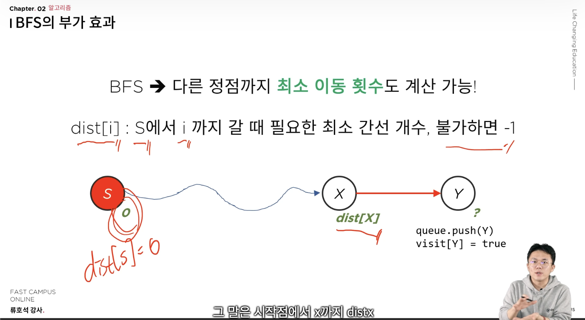
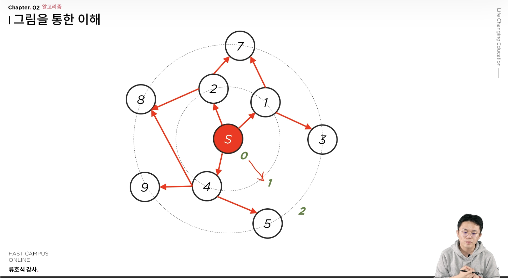

# 그래프 응용

## 1. 격자형 그래프를 표현하는 방법
- 대표 예시 문제: [BOJ2667 단지번호 붙이기](../../soving/src/main/java/me/sangjun/graph/README.md) 
- 이 문제처럼 2차원 배열에 표현된 그래프를 **격자형 그래프**라고 한다. 격자형 그래프를 코드로 표현하는 방법을 알고 있어야 한다. 정점과 간선을 어떻게 표현할지 고민하면 된다.
    - 이 문제에서는 각 격자 한칸이 정점. 인접하는 격자가 같은 값(1)인 경우, 간선으로 해석하면 된다.

### 1-1. 인접한 칸의 관계를 표현하는 배열 만들기
- **간선의 관계를 표현하는 배열을 만들면 이를 해결할 수 있다.**
  - 이 문제에서는 dir[4][2] = { (-1,0), (0,1) , (1,0) ,(0,-1) } 을 미리 저장하고, 모든 정점에 대해 해당 배열의 원소를 더해 인접한 정점을 구하면 된다.
- 이 문제처럼 간선의 관계가 인접한 경우인 경우에는 총 4가지의 케이스가 나오지만, 인접한 2칸인 경우에는 총 8가지가 된다. 이를 모두 조건문으로 작성해 줄 수 없으니, 이와 같은 배열을 사용하여 문제를 해결할 수 있다.

## 2. 전혀 그래프와 연관이 없어 보이나, 문제의 조건을 정점과 간선으로 잘 정의하여 그래프로 풀어야 하는 문제
- 대표 예시 문제: [BOJ2251 물통](../../soving/src/main/java/me/sangjun/graph/README.md)

## 3. MulitSource BFS 
- **시작점이 여러 개(n)인 그래프 탐색에서, BFS를 n번 수행하지 않고, 단 한번의 BFS로 탐색을 수행하는 것을 의미한다.**
- 기존의 BFS는 시작점 하나만 Queue에 넣고 while문을 시작했다면, 가능한 모든 시작점을 bfs 실행 초기에 전부 Queue에 넣은 상태로 BFS를 시작하는 것을 의미한다.
- 따라서 시간 복잡도는 O(V+E)가 유지된다.

### 3-1. 구현 코드
```java
import java.util.LinkedList;
import java.util.Queue;

//해당 함수의 의미: start에서 시작해서 갈 수 있는 정점들을 모두 탐색하기.

static void bfs(int start) {
    Queue<Integer> que = new LinkedList<>();

  /**
   * 새롭게 추가된 코드.
   * 예를 들어, 2차원 배열 안의 데이터가 2인 경우가 모두 탐색 시작점이 되야한다면, 아래와 같은 코드로 queue에 시작점 담기
   * (예시문제 BOJ 14502 연구소)
   */
  for (int i = 0; i < N; i++) {
    for (int j = 0; j < N; j++) {
      if (map[i][j] == 2) { //여기서 (i,j)를 아래 정점 v로 해석하면 된다.
        Node node = {i, j};
        que.add(node);
      } 
    }
  }

  /**
   * 아래는 기존 bfs와 동일하다.
   */
  que.add(start);
    visit[start] = true;

    while (!que.isEmpty()) {
        int v = que.poll();

        for (int w : v에서 갈 수 있는 노드들){
            if (visit[w]) {
                continue;
            }
            
            que.add(w);
            visit[w] = true;
        }
    }
}
```

# 그래프 응용2
## 1. BFS의 부가 효과
기존의 그래프의 탐색의 개념은 시작점에서 갈 수 있는 정점들은 어디인가?를 구하는데 초점이 맞춰져 있었다. 만약 다른 정점까지의 최소 이동 횟수를 구해야한다면 어떻게 해야할까? 
**BFS는 DFS와 다르게 다른 정점까지의 최소 이동 횟수도 계산할 수 있다.** DFS는 구현이 쉽다는 장점과 사실, DFS만의 부과효과로 풀 수 있는 알고리즘도 있다. (하지만 이는 코테영역에서 크게 사용되지 않기는 한다. 그래도 등한시 하지 말고 인지는 하고 있자.)

### 1.1 원리

dist[i] 라는 배열을 사용하면 최소 이동 횟수를 구할 수 있다. dist[i]는 S(시작점)에서 i까지 갈때의 최소 간선 개수를 의미하며, 이동이 불가하면 -1이 담기게 된다. (시작점인 s에 대해 dist[s]는 당연히 0이 될 것이다.)

위의 그림에서 시작점에서 X까지의 최소 거리를 dist[X]라고 한다면, 다음 정점인 Y에 대해 dist[Y] = dist[X] + 1이 될 것이다. **이는 Queue에 넣고 visit체크를 해주는 순간에 함께 병행해주면 된다.**

그렇다면 왜 너비우선탐색(BFS)에서만 이와 같은 성질을 이용할 수 있을까?


위의 그림을 보면, 너비우선 탐색은 시작점으로 부터 한칸 떨어진 정점들부터 순차적으로 탐색하기 때문에 이와 같은 부과효과를 갖고 있다.
다만 주의️⚠️해야할 점이 하나 있다. 최소 이동 횟수와 관련된 것이기 때문에, **가중치에 대한 개념이 없는 문제에서만 이 성질이 유효하다.** 

예를 들어, 동생을 찾을 수 있는 가장 빠른 시간이 몇초 후인가? 이동할 때 지나야 하는 최소 칸의 수, 고슴도치가 안전하게 비버의 굴로 이동하기 위해 필요한 최소시간 과 같은 문제에서만 의미가 있다. 

### 1.2 예시 문제
- 대표 문항: [BOJ2178 미로 탐색](../../soving/src/main/java/me/sangjun/graph/README.md)

