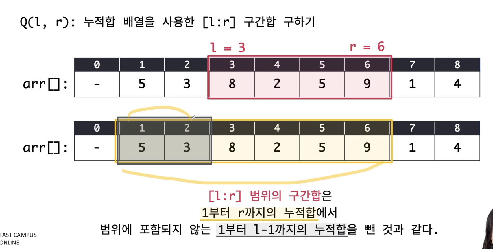

# Prefix Sum (구간합)

## 1. 개념
- **배열의 앞에서부터 차례대로 더한 값을 미리 저장해두는 알고리즘을 의미**

- 먼저 누적합 배열을 구해보자. 원본 배열 arr[]에 대해, 1~K 사이의 모든 합을 저장하는 배열을 acc[K]라고 정의하자. **이를 누적합 배열이라고 한다.**
  - 따라서, acc[3]은 arr[1] + arr[2] + arr[3]이 되며, acc[5] = acc[4] + arr[5] 이다.
- 누적합 배열을 이용하면 구간 합을 빠르게 구할 수 있다.

- [i:r] 구간합은 1부터 r까지의 누적합에서 1~i-1 까지의 누적합을 뺀것과 같다. **따라서 총 시간복잡도는 O(N) + O(1) 만큼 소요된다.** 

## 2. 누적합 배열, 구간합 구현 방법

### 2-1. 누적합 배열 구하기
**시간 복잡도 O(N)**
```java
int[] arr = new int[N + 1]; //원본 배열
int[] acc = new int[N + 1]; //누적합 배열
int sum = 0;

// 첫번재 방법
for(int i = 1; i <= N; i++){
    sum += arr[i];
    acc[i] = sum;
}

// 두번째 방법
for(int i = 1; i <= N; i++){
    acc[i] = acc[i - 1] + arr[i];
}
```

### 2-2. 구간합 구하기
**시간 복잡도 O(1)**
```java
int prefixSum = acc[j] - acc[i - 1];
```

## 3. 대표 예시 문제 - BOJ11659 구간합 구하기
- 문제: N개의 수가 주어졌을 때, M번의 (i,j) 질문에 대해, i번째 수부터 j번째 수까지 합을 구하는 문제
  - 1<N<1000000, 1<M<1000000
- 각 질문에 대해 매번 [i:j]를 순회하여 구현시 O(M*N)의 시간 복잡도 발생 -> 시간 초과시, 구간합 개념 사용 가능
- 구간합 개념을 사용한다면, O(N+M)시간 내에 해결가능

## ⭐️4. 구간합을 사용하기에 유리한 경우
- 항상 똑같은 배열을 가지고 쿼리를 날리는 경우에만 유리하다.
- 해당 배열이 각 쿼리 이후에 갱신된다면(쿼리의 횟수 Q), 이 또한 O(Q*N+M) 소요되므로, K가 큰 경우 유리하지 않을 수 있다.
